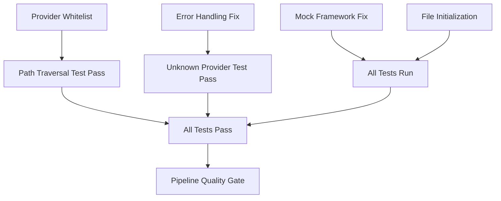

# Issue Triage & Priority Action Plan

This document provides a prioritized action plan focused on **correctness and functionality**. Issues are triaged into tiers based on their impact on the system's ability to function correctly.

---

## 🚨 TIER 1: BLOCKERS (Fix First - Breaking Core Functionality)

These issues directly cause test failures and must be fixed for the system to work correctly.

### 1.1 Provider Whitelist Validation
**Impact:** Path traversal test failing, security vulnerability  
**File:** `lib/command-builder.js:100-103`  
**Fix:** Add validation before line 100:
```javascript
const ALLOWED_PROVIDERS = ['claude', 'codex', 'gemini'];
if (!ALLOWED_PROVIDERS.includes(provider)) {
  if (this.verbose) {
    console.error(`Unknown provider: ${provider}`);
  }
  return null;
}
```
**Verification:** `npm test -- tests/integration/security.test.js:463`

### 1.2 Provider Error Handling
**Impact:** Unknown provider test failing  
**File:** `lib/command-builder.js:114-115`  
**Fix:** Replace throw with return null:
```javascript
default:
  if (this.verbose) {
    console.error(`Unknown provider: ${provider}`);
  }
  return null; // Don't throw, return null for graceful handling
```
**Verification:** `node -e "new (require('./lib/command-builder.js').default)().buildCommand('unknown').then(console.log)"`

### 1.3 Mock Framework Mismatch
**Impact:** Test infrastructure broken  
**File:** `__mocks__/child_process.js:1`  
**Fix:** Replace Jest with Vitest:
```javascript
// Line 1: Replace
import { jest } from '@jest/globals';
// With:
import { vi } from 'vitest';

// Update all jest.fn() to vi.fn()
```
**Verification:** `npm test -- --reporter=verbose`

### 1.4 Filesystem Mock Initialization
**Impact:** Tests fail with undefined errors  
**File:** `tests/integration/security.test.js:195-210`  
**Fix:** Ensure all required files are initialized:
```javascript
// Add after line 195
const dirs = [
  path.join(packageDir, 'prompts'),
  path.join(packageDir, 'config', 'providers'),
  path.join(packageDir, 'workspace', 'context')
];

// Initialize all prompt files
fs.setFile(path.join(packageDir, 'prompts', 'review.core.md'), 'Core prompt');
fs.setFile(path.join(packageDir, 'prompts', 'review.claude.md'), 'Claude prompt');
fs.setFile(path.join(packageDir, 'prompts', 'review.codex.md'), 'Codex prompt');
fs.setFile(path.join(packageDir, 'prompts', 'review.gemini.md'), 'Gemini prompt');
```

**⏱️ Estimated Time for Tier 1:** 1-2 hours  
**✅ Success Criteria:** All 54 tests pass

---

## ⚠️ TIER 2: CRITICAL (Configuration & Correctness Issues)

These cause incorrect behavior and violate configuration expectations.

### 2.1 Gemini YOLO Mode Forced On
**Impact:** Configuration ignored, unintended auto-approval  
**File:** `lib/command-builder.js:259-268`  
**Current Problem:** Forces `--approval-mode=yolo` even when config says `yolo: false`  
**Fix:**
```javascript
// Replace lines 255-268 with:
if (flags.sandbox !== false) {
  args.push('-s');
}

// Only enable YOLO if explicitly configured true
if (flags.yolo === true) {
  args.push('-y');
}
// Remove the forced --approval-mode=yolo
```
**Verification:** 
```bash
node -e "
  const cb = new (require('./lib/command-builder.js').default)();
  cb.buildCommand('gemini').then(cmd => 
    console.log('Has YOLO:', cmd.args.includes('-y'))
  );
"
```

### 2.2 Options.prompt Not Included
**Impact:** Custom prompts ignored  
**File:** `lib/command-builder.js:346-350`  
**Fix:** Uncomment the TODO code:
```javascript
// Uncomment lines 347-350
if (options.prompt) {
  sections.push('\n=== ADDITIONAL PROMPT ===');
  sections.push(options.prompt);
  sections.push('=== END ADDITIONAL PROMPT ===\n');
}
```

### 2.3 Pipeline Quality Gate Missing
**Impact:** Failed tests don't block merge  
**File:** `.github/workflows/pr-multimodel-review.yml:115`  
**Fix:** Remove failure suppression:
```yaml
# Replace line 115
- name: Run review pipeline tests
  run: |
    cd .review-pipeline
    npm test  # Remove the || echo suppression
```

**⏱️ Estimated Time for Tier 2:** 1 hour  
**✅ Success Criteria:** Configuration respected, prompts work, tests gate pipeline

---

## 🔒 TIER 3: HIGH (Security with Functional Impact)

Security issues that also affect correct execution.

### 3.1 TEST_CMD Shell Injection
**Impact:** Command execution vulnerability  
**File:** `.github/workflows/pr-multimodel-review.yml:172`  
**Current:** `sh -c "set -e; $TEST_CMD"`  
**Fix Option 1 (Simple):** Create safe wrapper script
```bash
#!/bin/bash
# scripts/run-tests-safe.sh
set -e
exec $@  # Use exec with arguments, not shell interpretation
```
```yaml
# Line 172
timeout 300 ./scripts/run-tests-safe.sh $TEST_CMD
```

### 3.2 Output Path Validation
**Impact:** Path traversal in output files  
**File:** `lib/execute-provider.js:287-291`  
**Fix:**
```javascript
// Replace lines 287-291
const relative = path.relative(expectedDir, resolvedPath);
if (relative.startsWith('..') || path.isAbsolute(relative)) {
  throw new Error(`Output path outside allowed directory: ${outputPath}`);
}
```

### 3.3 Aggregation on Invalid JSON
**Impact:** Incorrect summary from bad data  
**File:** `scripts/aggregate-reviews.mjs:80-95`  
**Fix:** Add strict mode:
```javascript
const strictMode = process.env.STRICT_VALIDATION === 'true';
if (!validate(json)) {
  if (strictMode) {
    throw new Error(`Invalid JSON from ${tool}, failing in strict mode`);
  }
  // ... existing warning logic
}
```

**⏱️ Estimated Time for Tier 3:** 2 hours  
**✅ Success Criteria:** No shell injection, paths validated, data integrity maintained

---

## 🛡️ TIER 4: MEDIUM (Hardening & Alignment)

Important for robustness but not blocking functionality.

### 4.1 Environment Sanitization
**File:** `lib/execute-provider.js:77-89`  
**Improvement:** Use clean-room approach instead of blacklist

### 4.2 Unit Test Alignment
**File:** `tests/unit/provider-executor.test.js:249-279`  
**Issue:** Tests expect filtering that doesn't happen

### 4.3 Command Injection via jq
**File:** `scripts/run-provider-review.sh:45-48`  
**Fix:** Validate extracted values against whitelist

**⏱️ Estimated Time for Tier 4:** 2 hours

---

## 📝 TIER 5: LOW (Documentation & Cleanup)

Non-functional improvements.

### 5.1 Keychain Diagnostics
**File:** `.github/workflows/pr-multimodel-review.yml:88-93`  
**Fix:** Guard with DEBUG flag or remove

### 5.2 Security Documentation
**File:** `SECURITY_NOTES.md`  
**Update:** Document actual state of fixes

### 5.3 Command Detection Cache
**File:** `lib/command-builder.js:38-80`  
**Improvement:** Cache detection results

**⏱️ Estimated Time for Tier 5:** 1 hour

---

## 🎯 Quick Fix Checklist (Tier 1 Only)

```bash
# 1. Fix provider validation (command-builder.js:100)
[ ] Add ALLOWED_PROVIDERS constant
[ ] Check provider against whitelist
[ ] Return null for invalid providers

# 2. Fix error handling (command-builder.js:114)
[ ] Change throw to return null

# 3. Fix mock framework (__mocks__/child_process.js)
[ ] Change jest imports to vitest
[ ] Update all jest.fn() to vi.fn()

# 4. Fix test initialization (tests/integration/security.test.js)
[ ] Initialize all prompt files in beforeEach
[ ] Set up proper directory structure in mock
```

---

## 🔄 Fix Dependencies



---

## 📊 Summary

**Total Issues:** 18  
**Blocking Functionality:** 4 (Tier 1)  
**Affecting Correctness:** 3 (Tier 2)  
**Security with Impact:** 3 (Tier 3)  

**Recommended Approach:**
1. **Day 1:** Fix all Tier 1 issues (2 hours) - Get tests passing
2. **Day 1:** Fix Tier 2 issues (1 hour) - Restore correct behavior  
3. **Day 2:** Fix Tier 3 issues (2 hours) - Security critical
4. **Day 2-3:** Address Tier 4-5 as time permits

**Total Estimated Time:** 6-8 hours for Tiers 1-3 (critical path)